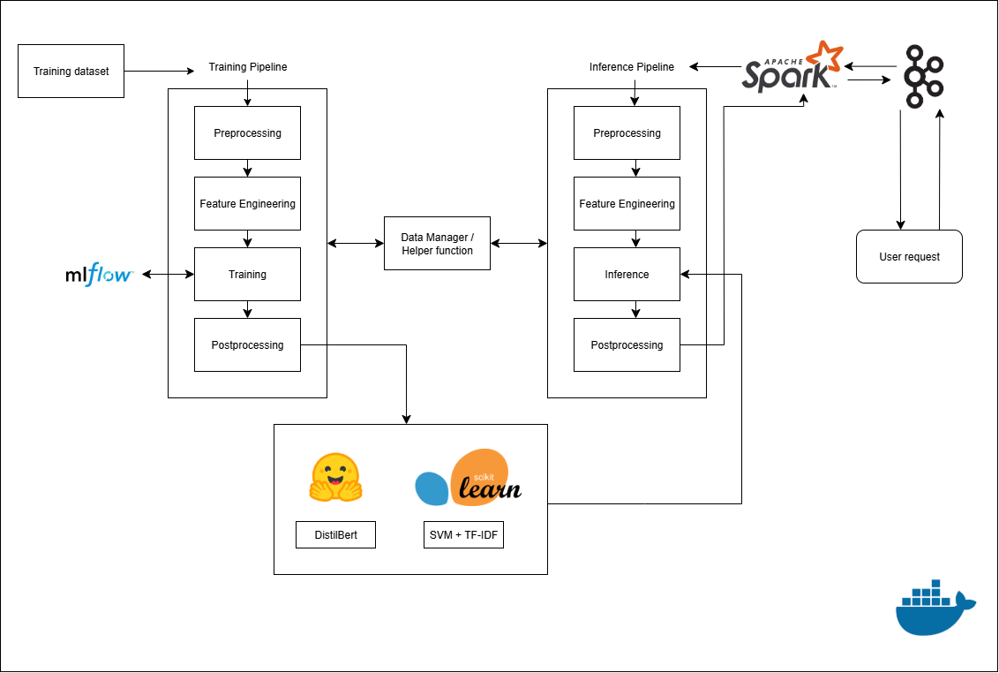

# Sentiment Analysis API
## Overview

This project provides real-time sentiment analysis of user-provided text using TF-IDF and BERT models.

It is designed for developers, companies, or anyone who wants to analyze text sentiment quickly via a REST API.

## Features

Text Prediction: Predict sentiment with both TF-IDF and BERT models

Interactive API: Send texts and retrieve predictions in real-time

Dockerized Deployment: Run locally or on cloud EC2 easily

Python Integration: Easily call the API from Python scripts

## Project Architecture

```bash
├── .env
├── .ipynb_checkpoints
│   └── Untitled-checkpoint.ipynb
├── README_Spark_Kafka.md
├── app-ml
│   ├── entrypoint
│   │   ├── Dockerfile
│   │   ├── inference.py
│   │   ├── inference_api.py
│   │   └── train.py
│   └── src
│       ├── pipelines
│       │   ├── __init__.py
│       │   ├── feature_engineer.py
│       │   ├── inferencing.py
│       │   ├── pipeline_runner.py
│       │   ├── postprocessing.py
│       │   ├── preprocessing.py
│       │   └── training.py
│       └── prototype
│           ├── .ipynb_checkpoints
│           │   └── prototype-checkpoint.ipynb
│           └── prototype.ipynb
├── common
│   ├── __init__.py
│   ├── data_manager.py
│   └── utils.py
├── config
│   └── config.yaml
├── data
│   ├── cleaned
│   │   └── cleaned_dataset.csv
│   ├── raw
│   │   └── raw_dataset.csv
│   └── real_time
│       ├── real_time_dataset.csv
│       └── test.py
├── docker-compose.yml
├── generate_tree.py
├── model
│   ├── bert
│   │   └── distilbert_model.pt
│   └── tfidf
│       └── svm_pipeline.pkl
├── requirements.txt
├── result_api.py
├── spark_jobs
│   ├── Dockerfile.spark
│   └── spark_streaming_job.py
```
## 📊 Project Flow



## Pipelines
### Training Pipeline

Preprocessing and Feature Engineering: Clean and encode texts for TF-IDF and BERT input.

Model Training:

Train TF-IDF + SVM classifier. (Using MLflow for keeping tracks the parameters and scoring metrices, e.g. Accuracy, F1, Recall, Precision)

Train DistilBERT for sentiment classification.

Model Saving: Store trained models for inference (svm_pipeline.pkl and distilbert_model.pt).

### Inference Pipeline

Input Handling: Receive texts via Flask API or real-time Kafka stream.

Spark Streaming: Process incoming messages in real time using PySpark, apply preprocessing, feature engineering and feed them into models.

Prediction:

Predict sentiment using TF-IDF + SVM.

Predict sentiment using BERT.

Postprocessing: Format outputs and return results via API or store in Kafka result queue.

## Quick Start
Option 1: Docker (Recommended)
### Clone repo
```bash
git clone <your-repo-url>
cd project
```

### Start services
```bash
docker-compose up --build
```

### Verify
```bash
docker-compose ps
docker-compose logs -f
```

Access API
API: http://localhost:8000

Option 2: Run Locally
### Clone repo
```bash
git clone <your-repo-url>
cd project
```

### Install dependencies
```bash
pip install -r requirements.txt
```

### Start API
```bash
python app/api/main.py
```

## Live Cloud Demo (EC2)

1. Start a session:

```bash
curl http://3.25.119.111:8000/start_session
```


Output:

```bash
{
  "client_id": "d02965ae-3928-481b-8704-493aca5df0a2"
}
```


2. Send texts for prediction:

```bash 
curl -X POST http://3.25.119.111:8000/predict \
-H "Content-Type: application/json" \
-d "{\"client_id\":\"d02965ae-3928-481b-8704-493aca5df0a2\",\"texts\":[\"I hate you\",\"Hello my name is Long, nice to meet you\",\"What is your name\",\"I love you\"]}"
```


Output:

```bash
{
  "message": "4 texts sent to Kafka for client d02965ae-3928-481b-8704-493aca5df0a2"
}
```

3. Get prediction results:
```bash
curl "http://3.25.119.111:8000/results?client_id=d02965ae-3928-481b-8704-493aca5df0a2"
```

Output:

```bash
[
  {"text":"I hate you","tfidf_prediction":0.9928,"bert_prediction":0.6267,"client_id":"d02965ae-3928-481b-8704-493aca5df0a2"},
  {"text":"Hello my name is Long, nice to meet you","tfidf_prediction":0.1324,"bert_prediction":0.4954,"client_id":"d02965ae-3928-481b-8704-493aca5df0a2"},
  {"text":"What is your name","tfidf_prediction":0.1940,"bert_prediction":0.4987,"client_id":"d02965ae-3928-481b-8704-493aca5df0a2"},
  {"text":"I love you","tfidf_prediction":0.3082,"bert_prediction":0.4843,"client_id":"d02965ae-3928-481b-8704-493aca5df0a2"}
]
```


4. Python Example Using Live API:

```bash
import requests
import time

BASE_URL = "http://3.25.119.111:8000"

# 1. Start a new session
resp = requests.get(f"{BASE_URL}/start_session")
resp.raise_for_status()
client_id = resp.json()["client_id"]
print(f"Session started: {client_id}")

# 2. Send texts for prediction
texts = [
    "I hate you",
    "Hello my name is Long, nice to meet you",
    "What is your name",
    "I love you"
]

payload = {"client_id": client_id, "texts": texts}
resp = requests.post(f"{BASE_URL}/predict", json=payload)
resp.raise_for_status()
print(resp.json())

# 3. Poll for results
results = []
while not results:
    time.sleep(1)
    resp = requests.get(f"{BASE_URL}/results", params={"client_id": client_id})
    resp.raise_for_status()
    results = resp.json()

print("Prediction results:")
for r in results:
    print(f"Text: {r['text']}")
    print(f"TF-IDF: {r['tfidf_prediction']:.3f}, BERT: {r['bert_prediction']:.3f}")
    print("---")
```

Output:
```bash
Session started: db6ee8ce-cb21-4d24-9fed-7d5e205df0f0
{'message': '4 texts sent to Kafka for client db6ee8ce-cb21-4d24-9fed-7d5e205df0f0'}
Prediction results:
Text: I hate you
TF-IDF: 0.993, BERT: 0.627
---
Text: Hello my name is Long, nice to meet you
TF-IDF: 0.132, BERT: 0.495
---
Text: What is your name
TF-IDF: 0.194, BERT: 0.499
---
Text: I love you
TF-IDF: 0.308, BERT: 0.484
---
```
