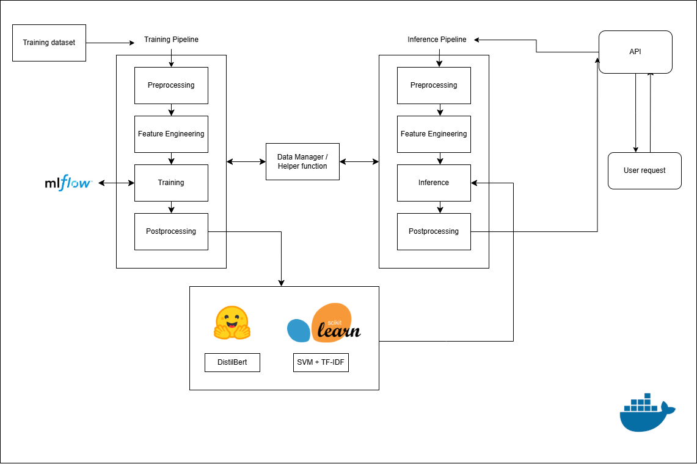

# Sentinex: Real-Time Toxicity Detection API
## Overview

This project provides real-time sentiment analysis of user-provided text using TF-IDF and BERT models.

It is designed for developers, companies, or anyone who wants to analyze text sentiment quickly via a REST API.

## Features

Text Prediction: Predict sentiment with both TF-IDF and BERT models

Interactive API: Send texts and retrieve predictions in real-time

Dockerized Deployment: Run locally or on cloud EC2 easily

Python Integration: Easily call the API from Python scripts

## Project Architecture

```bash
├── .gitignore
├── .ipynb_checkpoints
│   └── Untitled-checkpoint.ipynb
├── Dockerfile
├── README.md
├── app-ml
│   ├── entrypoint
│   │   ├── inference.py
│   │   ├── inference_api.py
│   │   └── train.py
│   └── src
│       ├── pipelines
│       │   ├── __init__.py
│       │   ├── feature_engineer.py
│       │   ├── inferencing.py
│       │   ├── pipeline_runner.py
│       │   ├── postprocessing.py
│       │   ├── preprocessing.py
│       │   └── training.py
│       └── prototype
│           ├── .ipynb_checkpoints
│           │   └── prototype-checkpoint.ipynb
│           └── prototype.ipynb
├── common
│   ├── __init__.py
│   ├── data_manager.py
│   └── utils.py
├── config
│   └── config.yaml
├── data
│   ├── cleaned
│   │   └── cleaned_dataset.csv
│   ├── raw
│   │   └── raw_dataset.csv
│   └── real_time
│       ├── real_time_dataset.csv
│       └── test.py
├── model
│   ├── bert
│   │   └── distilbert_model.pt
│   └── tfidf
│       └── svm_pipeline.pkl
├── requirements.txt
```
## 📊 Project Flow



## Pipelines
### Training Pipeline

Preprocessing and Feature Engineering: Clean and encode texts for TF-IDF and BERT input.

Model Training:

Train TF-IDF + SVM classifier. (Using MLflow for keeping tracks the parameters and scoring metrices, e.g. Accuracy, F1, Recall, Precision)

Train DistilBERT for sentiment classification.

Model Saving: Store trained models for inference (svm_pipeline.pkl and distilbert_model.pt).

### Inference Pipeline

Input Handling: Receive texts via Flask API

Prediction:

Predict sentiment using TF-IDF + SVM.

Predict sentiment using BERT.

Postprocessing: Format outputs and return results via JSON format.

## Quick Start
Option 1: Docker (Recommended)
### Clone repo
```bash
git clone https://github.com/LongTran1406/end_to_end_sentiment_analysis.git
cd end_to_end_sentiment_analysis
```

### Start services
```bash
docker-compose up --build
```

### Verify
```bash
docker-compose ps
docker-compose logs -f
```

Access API
API: http://localhost:8000

Option 2: Run Locally
### Clone repo
```bash
git clone https://github.com/LongTran1406/end_to_end_sentiment_analysis.git
cd end_to_end_sentiment_analysis
```

### Install dependencies
```bash
pip install -r requirements.txt
```

### Start API
```bash
python app-ml\entrypoint\inference_api.py
```

## Live Cloud Demo (EC2)
### Send texts for prediction:

```bash 
curl -X POST http://3.25.119.111:8000/predict \
-H "Content-Type: application/json" \
-d "{\"texts\":[\"I hate you\",\"Hello my name is Long, nice to meet you\",\"What is your name\",\"I love you\"]}"
```


Output:

```bash
[
  {"text":"I hate you","tfidf_prediction":0.9928,"bert_prediction":0.6267,"client_id":"d02965ae-3928-481b-8704-493aca5df0a2"},
  {"text":"Hello my name is Long, nice to meet you","tfidf_prediction":0.1324,"bert_prediction":0.4954,"client_id":"d02965ae-3928-481b-8704-493aca5df0a2"},
  {"text":"What is your name","tfidf_prediction":0.1940,"bert_prediction":0.4987,"client_id":"d02965ae-3928-481b-8704-493aca5df0a2"},
  {"text":"I love you","tfidf_prediction":0.3082,"bert_prediction":0.4843,"client_id":"d02965ae-3928-481b-8704-493aca5df0a2"}
]
```